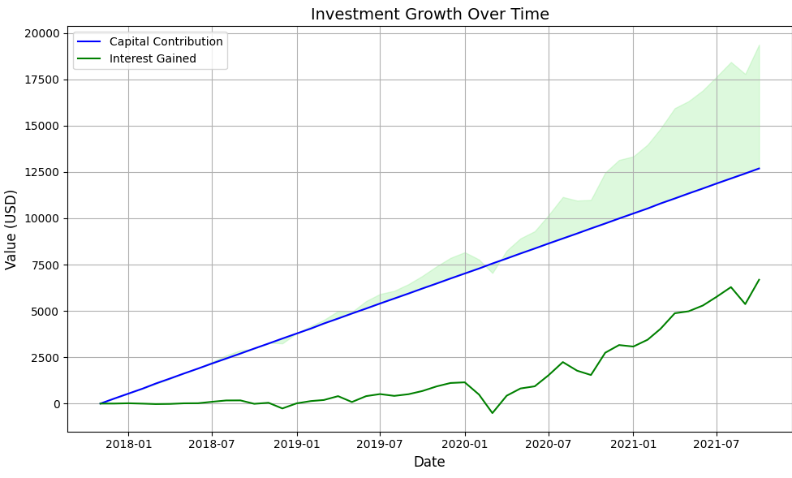

## investment-calculator



### Install

```bash
git clone https://github.com/xtianhb/investment-calculator.git
cd investment-calculator
./install.sh
```

## Run

```bash

python3 invest.py
```

## Configuration

Example:

```yaml
experiments:
  test:
    ticker_symbol: VOO
    start_date: "2017-10-15"
    end_date: "2021-10-15"
    interval_contribution: 1mo # 1 month
    initial_contribution: 1000.0
    periodic_contribution: 300.0
```

Will calculate the returns on historical data when you start with initial capital $1000, from start date to end date, compounded with montly contributions of $300, investing in the stock with symbol VOO.

